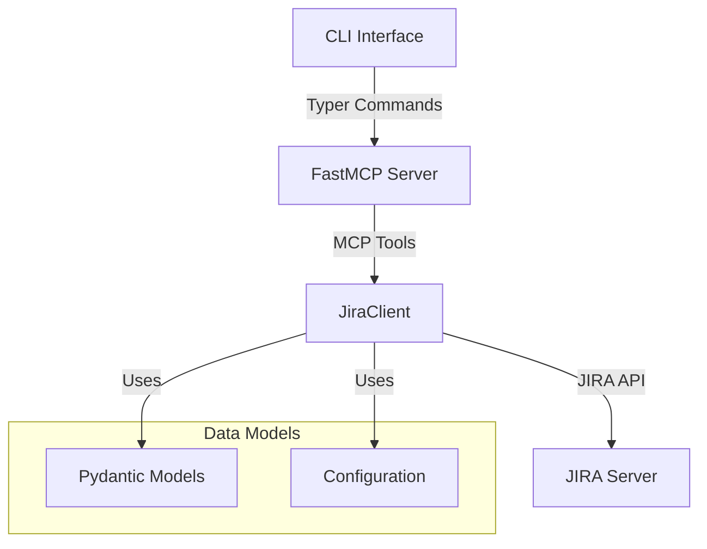
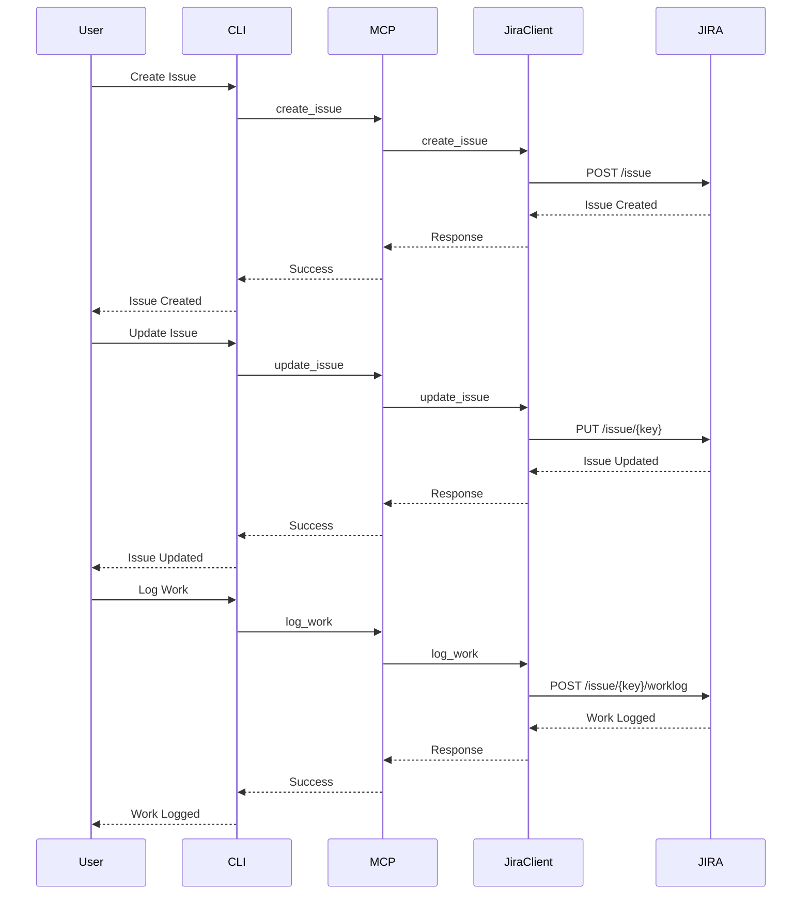
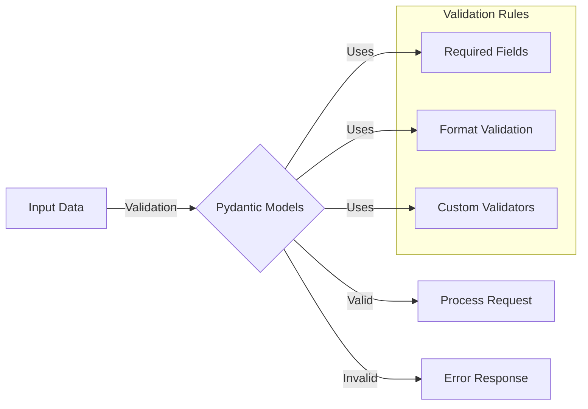
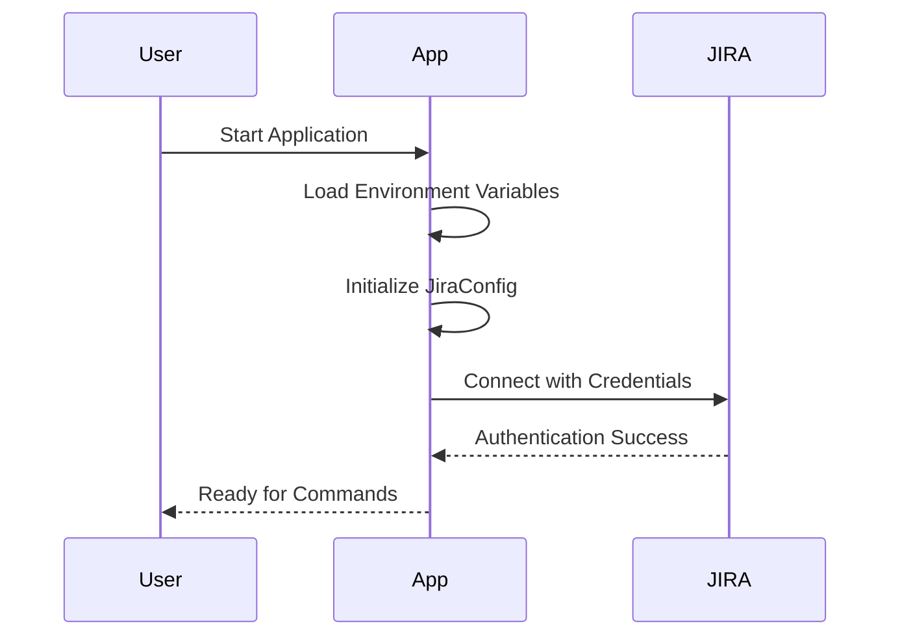

# Simple JIRA MCP Architecture

This document illustrates the architecture and workflows of the Simple JIRA MCP project using Mermaid diagrams. The project is designed to provide a seamless integration between Cursor IDE and JIRA, enabling AI-powered interactions with JIRA data through the Model Context Protocol (MCP).

## System Architecture

The system follows a layered architecture pattern, with clear separation of concerns between different components:

### Component Breakdown

1. **CLI Interface (Typer)**
   - Provides command-line interface for users
   - Handles argument parsing and validation
   - Routes commands to the MCP server

2. **FastMCP Server**
   - Implements the Model Context Protocol
   - Manages tool registration and execution
   - Handles communication between Cursor IDE and JIRA

3. **JiraClient**
   - Encapsulates all JIRA API interactions
   - Handles authentication and request formatting
   - Manages error handling and retries

4. **Data Models**
   - Pydantic models ensure data validation
   - Configuration management through environment variables
   - Type-safe data structures for API requests/responses

### About Pydantic

Pydantic is a data validation library for Python that uses Python type annotations to validate data. In this project, it's used to:

- Validate input data before sending to JIRA API
- Ensure type safety throughout the application
- Provide automatic data conversion and validation
- Generate JSON schemas for API documentation
- Handle configuration management

For example, when creating a new issue, Pydantic validates:
- Required fields are present
- Field types are correct (e.g., strings, numbers)
- Custom validation rules (e.g., project key format)
- Optional fields with default values

## Issue Lifecycle

The system supports a complete issue lifecycle, from creation through updates and work logging:

### Lifecycle Stages

1. **Issue Creation**
   - Validates required fields (project key, summary)
   - Supports optional fields (description, type, priority)
   - Returns the newly created issue key

2. **Issue Updates**
   - Allows modification of any editable fields
   - Supports partial updates
   - Maintains issue history

3. **Work Logging**
   - Tracks time spent on issues
   - Supports work descriptions
   - Maintains worklog history

## Data Validation Flow

Data validation is a critical component ensuring data integrity and API compatibility:

### Validation Components

1. **Input Data**
   - Command-line arguments
   - Environment variables
   - API request parameters

2. **Validation Rules**
   - Required field checking
   - Data format validation
   - Custom business rules
   - Type checking

3. **Error Handling**
   - Detailed error messages
   - Validation failure responses
   - API error mapping

## Authentication Flow

Secure authentication is handled through environment variables and API tokens:

### Security Implementation

1. **Credential Management**
   - Environment variable based configuration
   - Secure API token storage
   - No hardcoded credentials

2. **Connection Process**
   - Validates credentials on startup
   - Maintains authenticated session
   - Handles connection failures

3. **Error Handling**
   - Clear authentication error messages
   - Graceful failure handling
   - Secure error logging

## Design Principles

The architecture follows several key design principles:

1. **Separation of Concerns**
   - Clear boundaries between components
   - Modular design for easy maintenance
   - Independent testing capabilities

2. **Type Safety**
   - Pydantic models for data validation
   - Strong typing throughout the codebase
   - Runtime type checking

3. **Error Handling**
   - Comprehensive error catching
   - Detailed error messages
   - Graceful failure modes

4. **Extensibility**
   - Modular tool registration
   - Easy to add new features
   - Configurable components

## Future Considerations

The architecture is designed to support future enhancements:

1. **Potential Extensions**
   - Additional JIRA API endpoints
   - New MCP tools
   - Enhanced validation rules

2. **Scalability**
   - Connection pooling
   - Rate limiting
   - Caching mechanisms

3. **Monitoring**
   - Performance metrics
   - Usage statistics
   - Error tracking

These diagrams provide a visual representation of:
1. The overall system architecture and component relationships
2. The sequence of operations for issue lifecycle management
3. The data validation flow using Pydantic models
4. The authentication process

The diagrams can help new developers understand:
- How different components interact
- The flow of data through the system
- Where validation occurs
- How authentication is handled
- The sequence of operations for common tasks 