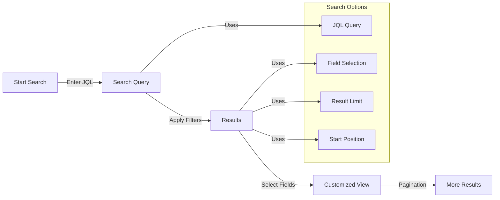
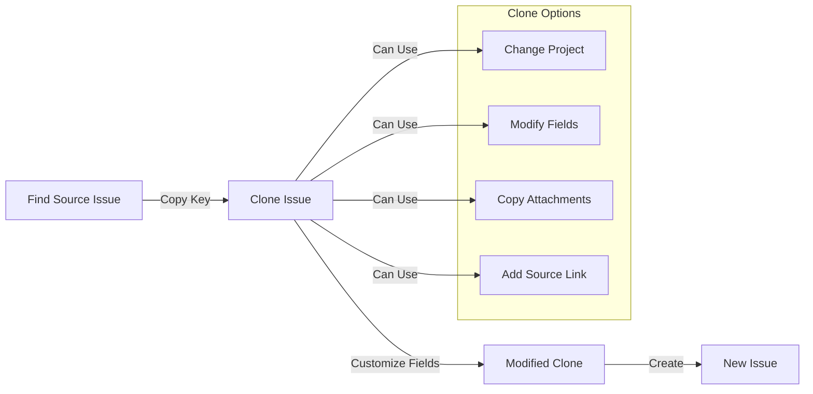

# JIRA MCP Server

A simple [Model Context Protocol (MCP)](https://github.com/modelcontextprotocol) "vibe-coded" server for integrating JIRA with Cursor IDE. MCP is an open protocol that enables seamless integration between LLM applications and external data sources and tools.

This implementation started out by discarding another JIRA MCP server that we failed to init in Cursor.

BEWARE! Even this document is almost entirely written by AI coding assistant.


## Features

- Get JIRA issues by key
- Search issues using JQL (JIRA Query Language)
- Create and update issues (note: may have limitations with heavily customized JIRA projects)
- Add comments to issues
- Clone issues (useful for working around mandatory custom fields, but may have limitations with complex project configurations)
- Configurable field selection
- Pagination support
- Detailed error handling and logging
- Log work

## User Workflows

### Search and Filter Flow



### Issue Cloning Flow



For detailed technical architecture and system workflows, including issue lifecycle and authentication flows, see [ARCHITECTURE.md](ARCHITECTURE.md).

## About MCP

This server implements the [Model Context Protocol](https://modelcontextprotocol.io) specification, allowing Cursor IDE to seamlessly interact with JIRA data through its AI features. The protocol standardizes how LLM applications communicate with external data sources and tools.

## Setup

1. Create a virtual environment:
```bash
python -m venv venv
source venv/bin/activate  # On Windows: venv\Scripts\activate
```

2. Install dependencies:
```bash
pip install -r requirements.txt
```

3. Configure environment variables:
Create a `.env` file with:
```
JIRA_URL=your_jira_url
JIRA_USERNAME=your_username
JIRA_API_TOKEN=your_api_token
```

## Usage

Run the server:
```bash
./run-jira-mcp.sh
```

## Development

The project follows a modular structure:

```
src/
├── core/           # Core JIRA client implementation
│   ├── __init__.py
│   ├── client.py   # JiraClient class
│   └── config.py   # Configuration management
├── models/         # Pydantic models for validation
│   ├── __init__.py
│   ├── comment.py  # Comment-related models
│   ├── issue.py    # Issue-related models
│   └── worklog.py  # Worklog-related models
└── operations/     # MCP operation implementations
    ├── __init__.py
    ├── comments.py # Comment operations
    ├── issues.py   # Issue operations
    ├── projects.py # Project operations
    └── worklog.py  # Worklog operations
```

### Key Components

1. **Models** (`src/models/`)
   - `IssueType`, `IssueArgs` - Issue creation/update models
   - `IssueTransitionArgs` - Issue state transition model
   - `CloneIssueArgs` - Issue cloning model
   - `CommentArgs`, `GetCommentsArgs` - Comment models
   - `LogWorkArgs` - Work logging model

2. **Core** (`src/core/`)
   - `JiraClient` - Main JIRA API client
   - `JiraConfig` - Configuration management
   - Error handling and logging

3. **Operations** (`src/operations/`)
   - Issue management (get, search, create, update, clone)
   - Comment handling (add, get)
   - Work logging
   - Project listing

The project follows the implementation plan outlined in `IMPLEMENTATION_PLAN.md`.

Current version: v0.4
- ✅ Basic JIRA integration
- ✅ Search functionality with JQL support
- ✅ Issue management (create, update, clone) with limitations for heavily customized projects
- ✅ Comment functionality
- ✅ Work logging

## Related Links

- [Model Context Protocol](https://github.com/modelcontextprotocol) - The main MCP project
- [MCP Python SDK](https://github.com/modelcontextprotocol/python-sdk) - The SDK we use to implement this server
- [MCP Documentation](https://github.com/modelcontextprotocol/docs) - Protocol documentation and specifications

## License

MIT 

## Security Considerations

This tool is primarily designed for personal workflow automation and individual developer use. Please be aware of the following security considerations:

### ⚠️ Usage Recommendations

- **Personal/Development Use**: Ideal for individual developers managing their JIRA workflows
- **Small Team Use**: Suitable for trusted team environments with proper security measures
- **NOT Recommended For**:
  - Production deployment in its current form
  - Multi-tenant environments
  - Public-facing services
  - Processing sensitive/regulated data

### 🔒 Security Requirements

If you choose to use this tool, please ensure:

1. Your JIRA instance uses HTTPS
2. You're using API tokens (not passwords) for authentication
3. Your `.env` file is properly secured and not committed to version control
4. You understand the risks of running third-party tools with JIRA access

### 🛡️ Best Practices

1. Regularly rotate your API tokens
2. Monitor your JIRA audit logs for unexpected activity
3. Use the most recent version of the tool
4. Review the code before use in your environment

### 📝 Note on Enterprise Usage

This tool is not currently hardened for enterprise security requirements. If you need a solution for enterprise deployment, consider:
- Implementing additional security controls
- Conducting a security review
- Contributing security improvements back to the project
- Using official enterprise-grade alternatives

For security-related concerns or to report vulnerabilities, please open an issue or contact the maintainers directly. 
