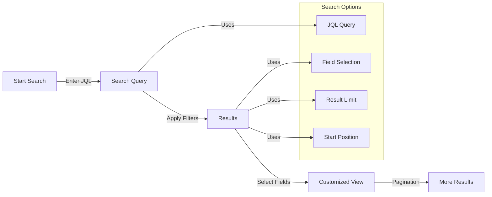
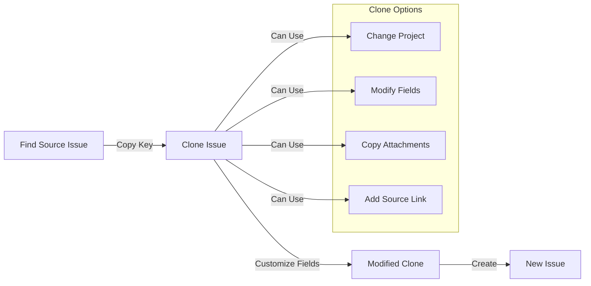

# JIRA MCP Server

A simple [Model Context Protocol (MCP)](https://github.com/modelcontextprotocol) "vibe-coded" server for integrating JIRA with Cursor IDE. MCP is an open protocol that enables seamless integration between LLM applications and external data sources and tools.

This implementation started out by discarding another JIRA MCP server that we failed to init in Cursor.

BEWARE! Even this document is almost entirely written by AI coding assistant.


## Features

- Get JIRA issues by key
- Search issues using JQL (JIRA Query Language)
- Create and update issues (note: may have limitations with heavily customized JIRA projects)
- Add comments to issues
- Clone issues (useful for working around mandatory custom fields, but may have limitations with complex project configurations)
- Configurable field selection
- Pagination support
- Detailed error handling and logging
- Log work

## User Workflows

### Search and Filter Flow



### Issue Cloning Flow



For detailed technical architecture and system workflows, including issue lifecycle and authentication flows, see [ARCHITECTURE.md](ARCHITECTURE.md).

## About MCP

This server implements the [Model Context Protocol](https://modelcontextprotocol.io) specification, allowing Cursor IDE to seamlessly interact with JIRA data through its AI features. The protocol standardizes how LLM applications communicate with external data sources and tools.

## Setup

1. Create a virtual environment:
```bash
python -m venv venv
source venv/bin/activate  # On Windows: venv\Scripts\activate
```

2. Install dependencies:
```bash
pip install -r requirements.txt
```

3. Configure environment variables:
Create a `.env` file with:
```
JIRA_URL=your_jira_url
JIRA_USERNAME=your_username
JIRA_API_TOKEN=your_api_token
```

## Usage

Run the server:
```bash
./run-jira-mcp.sh
```

## Development

The project follows the implementation plan outlined in `IMPLEMENTATION_PLAN.md`.

Current version: v0.4
- ✅ Basic JIRA integration
- ✅ Search functionality with JQL support
- ✅ Issue management (create, update, clone) with limitations for heavily customized projects
- ✅ Comment functionality
- ✅ Work logging

## Related Links

- [Model Context Protocol](https://github.com/modelcontextprotocol) - The main MCP project
- [MCP Python SDK](https://github.com/modelcontextprotocol/python-sdk) - The SDK we use to implement this server
- [MCP Documentation](https://github.com/modelcontextprotocol/docs) - Protocol documentation and specifications

## License

MIT 
