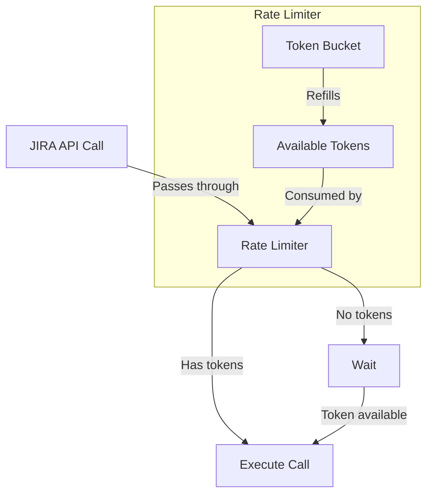
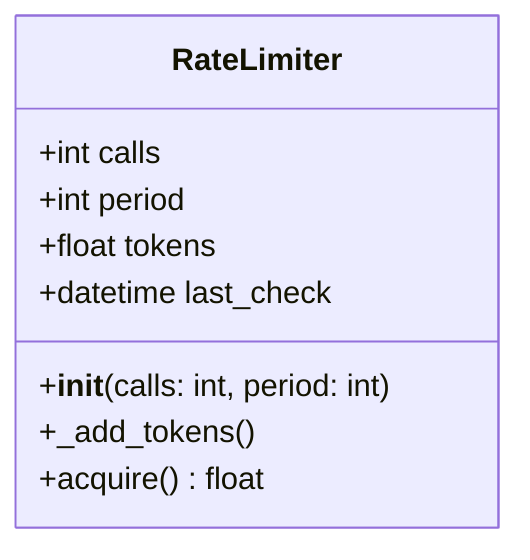
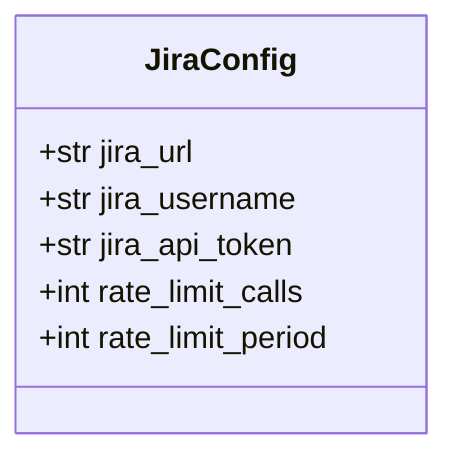
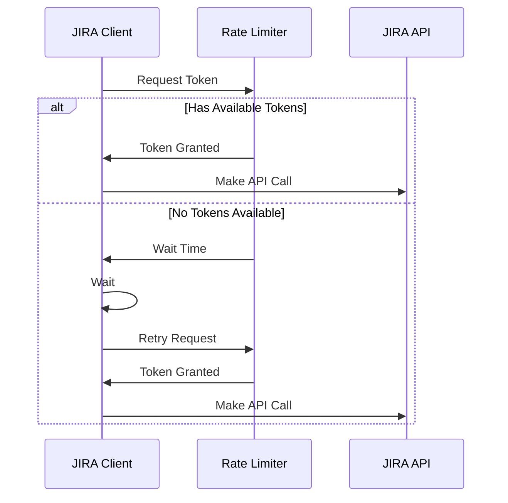
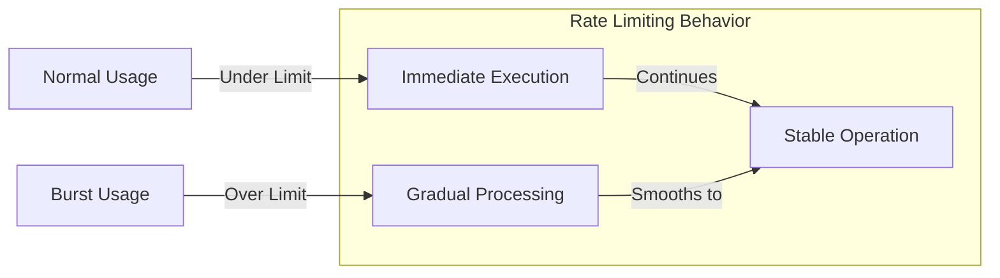

# Rate Limiting Implementation

## Overview

This document describes the rate limiting implementation for the JIRA MCP server. The implementation uses a token bucket algorithm to provide smooth and efficient rate limiting for all JIRA API calls.

## Architecture



## Components

### 1. Rate Limiter Class

The `RateLimiter` class implements the token bucket algorithm:



### 2. Configuration

Rate limiting configuration in `JiraConfig`:



### 3. Integration Flow



## Usage

The rate limiting is automatically applied to all JIRA API methods through a decorator:

```python
@rate_limited(calls=30, period=60)
def api_method():
    # Method implementation
```

## Configuration

Default configuration:
- 30 calls per 60-second period
- Configurable through environment variables or direct configuration

## Monitoring

The rate limiter includes logging for monitoring:
- Logs when rate limit is reached
- Includes wait times in logs
- Can be used for usage analysis

## Benefits

1. **Smooth Rate Limiting**
   - Token bucket algorithm provides smooth rate limiting
   - Allows bursts within limits
   - Prevents API quota exhaustion

2. **Flexibility**
   - Configurable limits
   - Per-instance rate limiting
   - Can be adjusted based on needs

3. **Monitoring**
   - Built-in logging
   - Wait time tracking
   - Usage patterns visible

## Example Usage Pattern



## Implementation Details

The rate limiting is implemented in three main files:

1. `src/utils/rate_limit.py`
   - Core rate limiting implementation
   - Token bucket algorithm
   - Decorator implementation

2. `src/core/config.py`
   - Rate limiting configuration
   - Default values
   - Environment variable support

3. `src/core/client.py`
   - Integration with JIRA client
   - Automatic application to API methods
   - Runtime configuration 